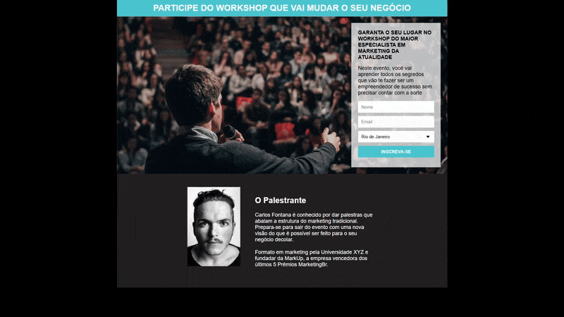

# Páginas de Captura

> Nesse projeto foi desenvolvido uma página captura aonde o usuário inserir nome, email e estado, o cadastro está integrado com o MailChip

### Tecnologias usadas

O projeto utiliza as seguintes tecnologias:

- HTML
- CSS

## 📝 Licença

Esse projeto está sob licença. Veja o arquivo [LICENÇA](LICENSE) para mais detalhes.